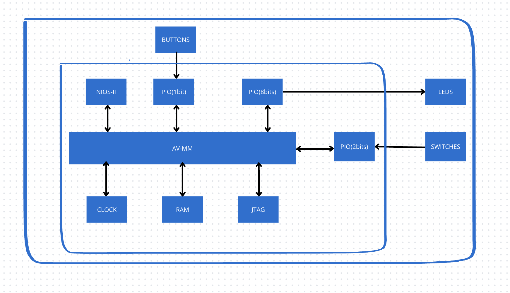
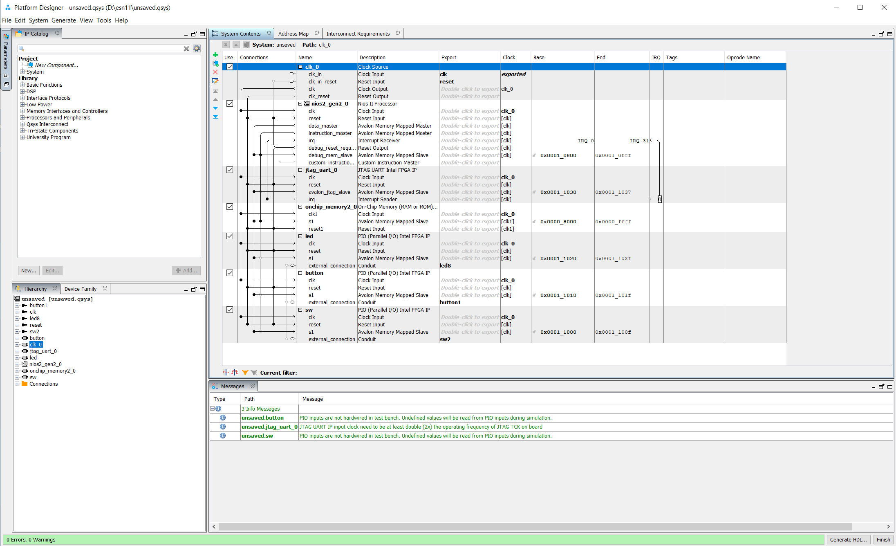

# Zhao_lab1

## Introduction

Dans ce projet, nous allons concevoir conjointement un FPGA et un processeur Nios II softcore afin d’explorer les méthodes de conception collaboratives entre le matériel et le logiciel. Le projet est basé sur la carte de développement DE10-Lite et utilise l’outil de conception Quartus pour la réalisation. Grâce à cette approche, nous créerons un système minimaliste capable de régler la vitesse d’un chenillard à l’aide de deux interrupteurs et de démarrer le chenillard avec un bouton. Les interrupteurs (SW) intégrés à la carte seront instanciés comme des périphériques du Nios II, dont deux seront utilisés pour contrôler la vitesse du chenillard, offrant deux niveaux de vitesse différents. Ces fonctionnalités seront programmées en langage C. Ce projet a pour objectif de mieux comprendre les processus de conception combinant matériel et logiciel sur une plateforme FPGA, tout en se familiarisant avec le processeur Nios II, la configuration de ses périphériques et l’utilisation de l’outil Quartus.  

## Architecture du sytème

Le système est composé d’une architecture de base comprenant un processeur Nios II, une mémoire RAM, une horloge (Clock) et un port JTAG. À cette architecture de base s’ajoutent des périphériques supplémentaires, notamment un PIO de 8 bits pour les LEDs, un PIO de 2 bits pour les commutateurs (Switches) et un PIO de 1 bit pour le bouton .

## Platform Designer
Comme décrit précédemment, l’architecture comprend trois PIO : un PIO d’entrée de 1 bit pour le bouton-poussoir (BP), un PIO d’entrée de 2 bits pour les commutateurs (SW), et un PIO de sortie de 8 bits pour les LEDs.

## Quartus
Dans Quartus, nous rédigeons le fichier de haut niveau light.vhd et utilisons l’outil Pin Planner pour effectuer l’attribution des broches conformément aux définitions fournies par la DE10-Lite. Ensuite, nous procédons à une compilation complète du design et, en l’absence d’erreurs, nous pouvons programmer l’architecture sur la carte de développement.

## Nios-II
À l’aide du terminal Nios II, nous commençons par exécuter la commande suivante pour générer le fichier BSP (Board Support Package) :  
***nios2-bsp hal software/led_bsp unsaved.sopcinfo*** 
Ensuite, nous utilisons la commande suivante pour créer le fichier Makefile :
***nios2-app-generate-makefile -app-dir ./ --bsp-dir D:\\esn11\\software\\led_bsp --src-files main.c***
***make download-elf*** 
Une fois ces étapes terminées, nous pouvons écrire un script en langage C, le compiler, puis le téléverser sur la carte de développement pour l’exécuter.

## Résultats

[click here to access the video](./lab1.mp4)

## Conclusion
À la fin de ce tutoriel, nous avons appris à décrire un système sur FPGA, à utiliser l’outil de planification des broches pour connecter des périphériques externes au FPGA, et à intégrer des blocs IP via le Platform Designer. De plus, nous avons utilisé la suite de bibliothèques HAL et une approche de co-conception matériel-logiciel pour écrire et exécuter un programme en langage C permettant de contrôler ces périphériques.

Le laboratoire 1 a été une expérience très réussie pour moi, avec peu de difficultés rencontrées. C’était la première fois que j’avais l’occasion de travailler sur un matériel réel, ce qui a été crucial pour me familiariser avec les outils nécessaires à l’utilisation du matériel et du logiciel. Pendant l’expérience, j’ai consolidé mes compétences et mis en pratique les connaissances théoriques acquises.

La seule difficulté a concerné la gestion des interruptions, notamment la manière de déclarer correctement une interruption et d’utiliser des fonctions appropriées pour la libérer et la réinitialiser. Ce problème a légèrement retardé le progrès, mais en ajustant la syntaxe et en modifiant l’approche, nous avons réussi à surmonter ce défi.

Dans l’ensemble, cette expérience a été une étape importante et constructive dans mon apprentissage. Elle m’a permis de mieux comprendre les concepts liés au développement sur matériel réel et d’améliorer ma capacité à résoudre des problèmes de manière flexible, tout en approfondissant mes connaissances sur la gestion des interruptions.